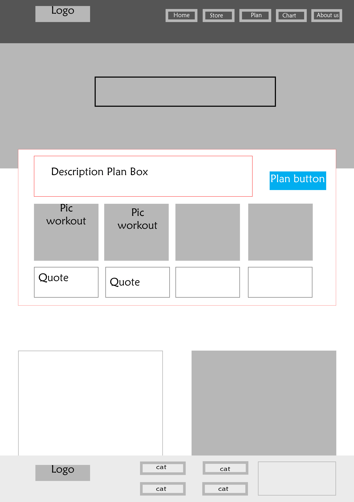
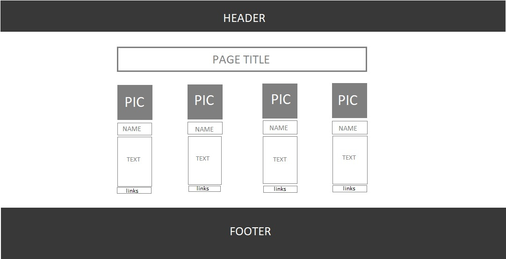
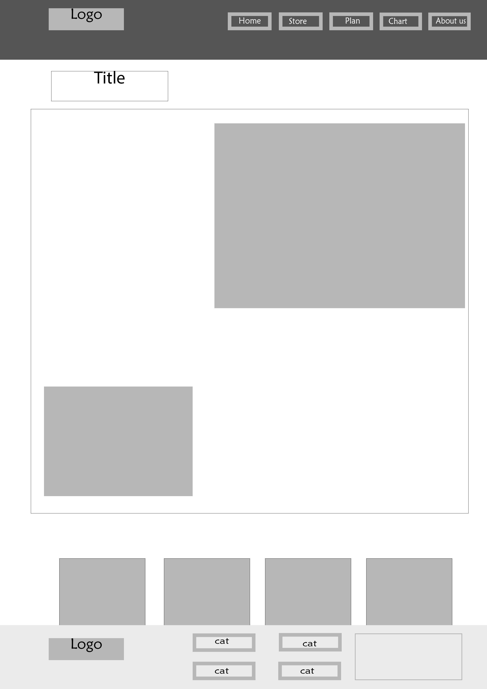
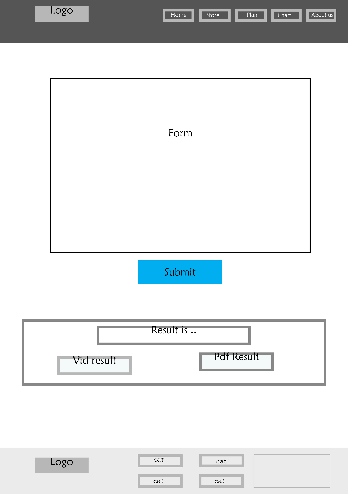
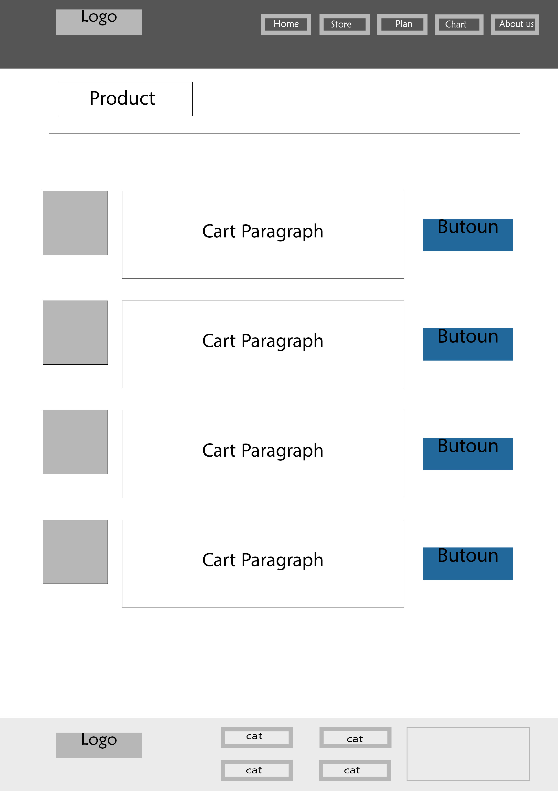
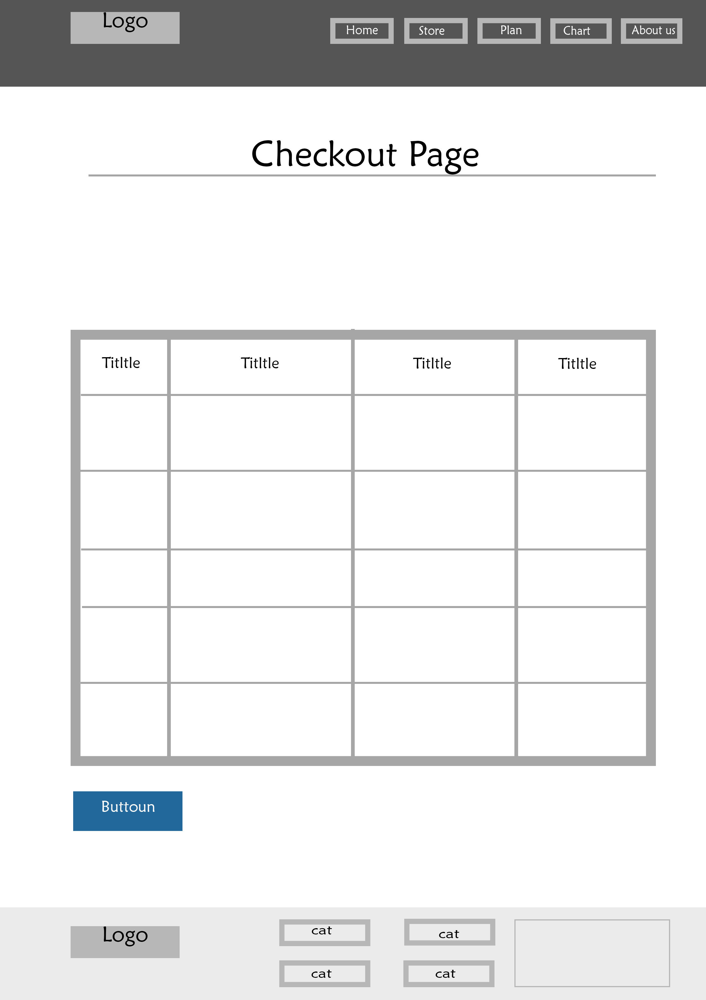
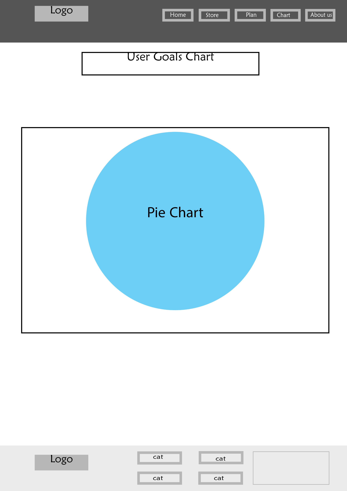

# 2fit-201-project

## Students Names 

---- This is an alphabetical order, contribution is even ---- 
- Abdullah Al Sawalmeh 
- Ayman Naif 
- Hala khamayseh 
- Umamah Mahmoud

## **[ 2FIT ]**

**What is 2FIT?**
A web application project oriented to people who have fit related goals but need a help to figure out the way to get their body health goals. Through customized diet plan and workout plan.

**How will we achieve that?** (Also known as "features")  
1. Providing an interactive homepage that will be attractive to our clients. It should give them a grasp on what is he getting from this website.
2. Taking the user to a page were they can fill a form that takes different kinds of input (text, selection...). Regarding some personal info (weight,  height, body goals...). That we will use to customize their plan.
3. Providing a page with customized diet and workout plan .
4. Adding to the results page a link to our shop page so if the client wants to purchase some supplements or workout equipment.
5. Adding an option for the client to checkout static chart for all of our clients (The chart would show how many other clients chose this goal or that).

**STRETCH GOALS:**  
1. Enabling the client to have a pdf copy of thier personal plan.
2. Adding a page for friend pages with related topics. And some success stories for motivation.

## WireFrames 

#### HomePage
;

#### About-us
;

#### blog
;

#### plan
;

#### store
;

#### cart
;

#### chart
;

## User Stories

1- As a I user, I need an index.html page, which should include these features:
- Modern design.
- include a nice header and footer.

2- As a I user, I need an plan.html page, which should include these features:
- Form to submit user data.
- box to show user plan the fits him.

3- As a I user, I need an products.html page, which should include these features:
- Showw all the website products.
- Filtering feature. 
- Add to cart button.

4- As a I user, I need an cart.html page, which should include these features:
- Show all added products to the cart, named checkout. 
- a way to delete the user choice of the products in the cart.

5- As a I user, I need an chart.html page, which should include these features:
- chart to show how customer choose [bodybuilding, gain weight, loss weight].

